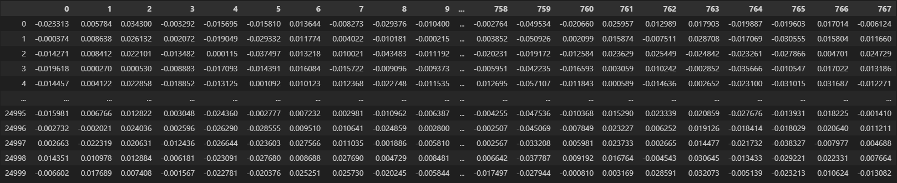
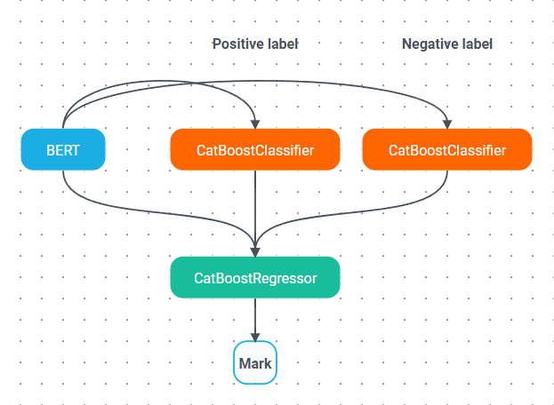

### Отчёт по тестовому заданию

В рамках задачи была проведена исследовательская работа для поиска оптимального метода классификации отзывов. Изначально для решения использовалась связка BERT и CatBoostRegressor. По мере работы модель CatBoostRegressor была дополнена вспомогательными моделями, тогда как архитектура BERT оставалась неизменной.

#### Ход работы:

- **1-я итерация**: Использование BERT в комбинации с CatBoostRegressor. Итоговый скор модели составил **0.45**. Применение GridCV не дало значимого улучшения.

  
- **2-я итерация**: Замена BERT на обученную модель Word2Vec. Результат – **0.5**.
  
- **3-я итерация**: Использование самостоятельно обученной модели Word2Vec. Результат – **0.45**.

- **4-я итерация**: Добавление к регрессору двух классификаторов CatBoost. Эти модели классифицировали отзывы как положительные или отрицательные. Их предсказания добавлялись к вектору эмбеддингов, который затем подавался на вход регрессору. Результаты: точность классификаторов составила **0.8**, а итоговая оценка регрессора – **0.65**.

#### Вывод:
Использование одного регрессора показало недостаточную эффективность для данной задачи. Внедрение ансамбля моделей значительно улучшило качество предсказаний без значительного увеличения сложности системы.